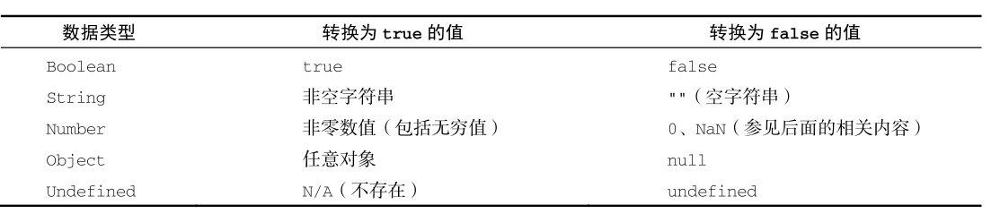
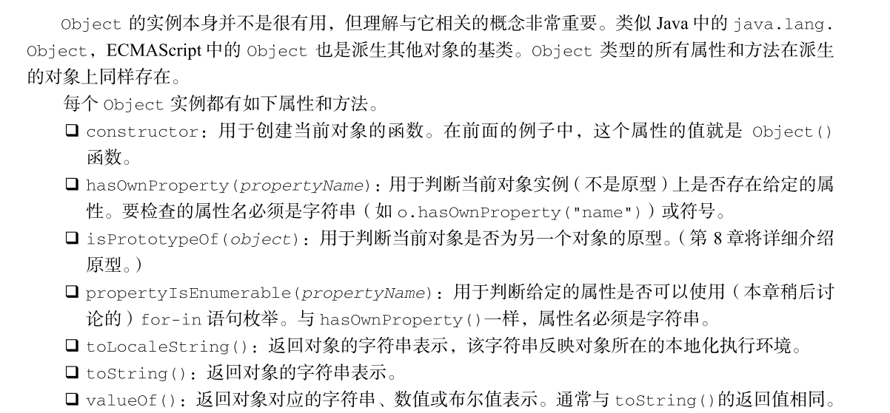

# 语言基础
## 语法
### 区分大小写
ECMAScript 中一切都区分大小写。无论是变量、函数名还是操作符，都区分大小写。
```javascript
let name='dsys'
let Name='dsys'
```
### 标识符
标识符由一个或者多个字符组成：第一个字符必须是字母、下划线、或者美元符号$,剩下的字符必须是字母、下划线、美元符号或者数字。
### 注释
```
//单行注释
/*多行注释*/
```
### 严格模式
ECMAScript5增加了严格模式（strict  mode）的概念。严格模式是一种不同的 JavaScript 解析和执行模型，ECMAScript 3 的一些不规范写法在这种模式下会被处理，对于不安全的活动将抛出错误。要对整个脚本启用严格模式，在脚本开头加上这一行： 
```
'use strict';
```
### 语句
ECMAScript 中的语句以分号结尾。省略分号意味着由解析器确定语句在哪里结尾，如下面的例子
所示： 
```
let sum=a+b
let sum=a+b;
```
## 关键字与保留字
ECMA-262 描述了一组保留的关键字，这些关键字有特殊用途，比如表示控制语句的开始和结束，或者执行特定的操作。按照规定，保留的关键字不能用作标识符或属性名。ECMA-262 第 6 版规定的所有关键字如下：

break       do          in            typeof 
case        else        instanceof    var 
catch       export      new           void 
class       extends     return        while 
const       finally     super         with 
continue    for         switch        yield 
debugger    function    this 
default     if          throw 
delete      import      try

规范中也描述了一组未来的保留字，同样不能用作标识符或属性名。虽然保留字在语言中没有特定用途，但它们是保留给将来做关键字用的。 
以下是 ECMA-262 第 6 版为将来保留的所有词汇。 
始终保留: 
enum  
严格模式下保留: 
implements  package     public 
interface   protected   static 
let         private 
模块代码中保留: 
await 

## 变量
### var关键字
```js
function foo(){
    console.log(age);
    var age=26;
}
foo() //undefined
变量提升等同于
function foo(){
    var age;
    console.log(age);
    age=26;
}
foo() //undefined
```
### let关键字
let作用是块级作用域,var是函数作用域
```js
if(true){
    var age=3
}
console.log(age) //3
if(true){
    let age=3
}
console.log(age)//ReferenceError: age没有定义
```
### var与let区别
1. var存在变量定义提升,var是函数作用域，let是块级作用域
2. var全局声明，成为window对象的属性
3. var可以重复定义，let不能重复定义

### const关键字
const 的行为与 let 基本相同，唯一一个重要的区别是用它声明变量时必须同时初始化变量，且尝试修改 const 声明的变量会导致运行时错误。 
```js
const name='dsys'
const person={}
person.name='dsys'
```
## 数据类型
ECMAScript有6种简单数据类型：Undefined、Null、Boolean、Number、String、Symbol、Object。typeof操作可以确定任意变量的数据类型。对一个值使用typeof操作符会返回下列字符串之一：
- "undenfied"表示值未定义
- "boolean"表示值为布尔值
- "string"表示值为字符串
- "object"表示值为对象或者为null
- "function"表示值为函数
- "symbol"表示值为符号
### Undefined
var,let声明的变量未赋值就是undenfied
### Null类型
null值表示一个空指针对象值
```js
let var=null
typeof var //Object
```
### Boolean类型
不同对象对应的boolean类型

### Number类型
```
let a=07; 八进制
let b=0xff; 16进制
let c=1.1;浮点数
let d=3.125e
```
#### 值的范围
ECMAScript 可以表示的最小数值保存在 Number.MIN_VALUE 中，这个值在多数浏览器中是 5e324；可以表示的最大数值保存在Number.MAX_VALUE 中，这个值在多数浏览器中是 1.797 693 134 862 315 7e+308。如果某个计算得到的数值结果超出了 JavaScript 可以表示的范围，那么这个数值会被自动转换为一个特殊的 Infinity （无穷）值。任何无法表示的负数以 -Infinity （负无穷大）表示，任何无法表示的正数以 Infinity （正无穷大）表示。
#### NaN
NaN表示not a number
```js
0/+0 //NaN
0/-0 //NaN
5/0 //Infiniy
5/-0 //-Infinity
isNaN('10') //false 可以转换为10
isNaN('zyw') //true
isNaN(true) //false 可以转换为1
```
#### 数值转换

用Number() 函数转换字符串时相对复杂且有点反常规，通常在需要得到整数时可以优先使用 parseInt() 函数。 parseInt() 函数更专注于字符串是否包含数值模式。字符串最前面的空格会被忽略，从第一个非空格字符开始转换。如果第一个字符不是数值字符、加号或减号， parseInt() 立即返回 NaN 。这意味着空字符串也会返回 NaN （这一点跟 Number() 不一样，它返回 0）。

如果第一个字符是数值字符、加号或减号，则继续依次检测每个字符，直到字符串末尾，或碰到非数值字符。比如，"1234blue" 会被转换为 1234，因为 "blue" 会被完全忽略。类似地， "22.5" 会被转换为 22，因为小数点不是有效的整数字符
```js
Number(true) //1
Number(null) //0
Number(undenfined) //NaN
Number('011')//11
Number('')//0
Number('0x0a')//10
Number(对象)//先调用valueOf()为NaN的话，在使用toString()
parseInt('10') //10
parsetFloat('10.0')//10.0
parseInt('10',2)//按照2进制转换
```
### String类型
#### 字符串表示方法
字符串可以使用单引号、双引号、反引号表示
```js
let a='author'
let b="dsys"
let c=`code
home`
let d=`${a}:${b}`//author:dsys
```
#### 字符字面量
\n 换行
\t 制表
\r 回车
\xnn 16进制表示的字符
\unnnn unicode表示的字符
### Symbol类型
Symbol （符号）是 ECMAScript 6 新增的数据类型。符号是原始值，且符号实例是唯一、不可变的。符号的用途是确保对象属性使用唯一标识符，不会发生属性冲突的危险。 
```js
Symbol('test')===Symbol('test')//false
let obj={[Symbol("a")]:1}
//作为枚举使用
const sex={
    MAN:Symbol(),
    WONAN:Symbol()
}
if(Symbol.for(sex)===sex.MAN){

}
```
### Object类型
ECMAScript 中的对象其实就是一组数据和功能的集合。对象通过 new 操作符后跟对象类型的名称来创建。开发者可以通过创建 Object 类型的实例来创建自己的对象，然后再给对象添加属性和方法。
```js
let obj=new Object()
```


### 函数
ECMAScript 中的函数与其他语言中的函数不一样。 
- 不需要指定函数的返回值，因为任何函数可以在任何时候返回任何值。 
- 不指定返回值的函数实际上会返回特殊值 undefined 。