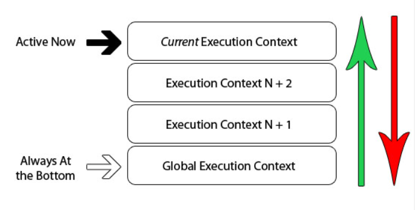

## 原始值与引用值
在JS中变量可以包括两种值：原始值与引用值。
- 原始值为Undefined 、 Null 、 Boolean 、 Number 、 String 和 Symbol。保存原始值的变量是按值访问的。原始值是复制值
- 引用值指向保存在内存中对象，引用值是复制引用
- 通过typeof确定变量是原始值还是引用值
- 通过instanceof确定变量是什么类型的对象
## 动态属性
JS中原始对象不能有动态属性，引用值指向的对象可以有动态属性。原始值使用New会创造一个Object对象实例。
```js
let user="dsys"
user.name='aa'
console.log(user.name)//undefined
let user1=new String("dsys")
user1.name="aa"
console.log(user1.name)//aa
```
## 传递参数
JS中传递的参数原始值都是复制值，引用值复制引用对象。
### 执行上下文与作用域
变量或者函数的上下文决定了他们能够访问那些数据，以及他们的行为。每个上下文都有一个与之关联的**变量对象**，而这个上下文所有的变量跟函数都会存在于这个对象之上。
执行上下文可以理解为当前代码的运行环境。在 JavaScript 中，运行环境主要包含了全局环境和函数环境。
### 全局执行上下文
在浏览器中全局上下文，也就是最外层的上下文就是我们所说的window对象。因此所有使用var定义的对象，都会成为window对象的属性以及方法。
上下文在其所有代码都执行完毕后会被销毁，包括定义在它上面的所有变量和函数（全局上下文在应用程序退出前才会被销毁，比如关闭网页或退出浏览器）。
### 函数执行上下文
每个函数会在执行的时候创建自己的执行上下文
### Eval函数执行上下文
使用eval()函数也会创建一个新的执行上下文
## 编译阶段与执行阶段
var num;与num=3属于代码执行的不同阶段的任务-编译阶段与执行阶段。编译阶段发生在执行之前，var a;先被执行。
```js
a=3;
var a;
console.log(a)//输出3
```
### 执行上下文的组成
```js
ExecutionContext={
    //this
    ThisBinding=<this value>
    //词法环境
    LexicalEnvironment={...},
    //变量环境
    VariableEnvironment={....}
}
```
#### 确定this指向
在全局执行上下文中this指向window，严格模式为undefined
在函数执行上下文中this指向实际调用函数的对象。
```js
var name="window"
let hello={
    name:'hello'
    helloThis:function(){console.log(this.name)}
}
hello.hellThis()//hello
let ht=hello.helloThis
ht();//window
```
#### 词法环境
词法环境是一个包含标识符变量映射的结构：
标识符指：变量或者函数的名称
变量值：对实际对象或者原始值的引用
词法环境包括环境记录器与对外部环境的引用。
环境记录器存储当前环境中变量和函数声明的实际位置,外部环境引用对应着可以访问其他外部环境（所以子作用域可以访问父作用域）。
执行上下文有全局执行上下文与函数执行上下文两种，而词法环境也有两种：
- 全局环境中是对象环境记录器，没有外部环境引用（为 null ）。它拥有内建的 Object、Array 等、在环境记录器内的原型函数（关联全局对象，比如 window 对象）和任何用户定义的全局变量，并且 this 的值指向全局对象。
- 函数环境中是声明式环境记录器，存储着函数内部定义的变量。并且引用的外部环境可能是全局环境，或者任何包含此函数的外部函数环境。它还包含了用户在函数中定义的所有属性方法外和一个 arguments 对象和传递给函数的参数的 length。
```js
//全局环境
GlobalExectionContext = {
    //词法环境
    LexicalEnvironment: {
        EnvironmentRecord: {
            //对象环境记录器
            Type: "Object",
          // 在这里绑定标识符
        }
        outer: <null>
    }
}
//函数环境
FunctionExectionContext = {
    //词法环境
    LexicalEnvironment: {
        //环境记录器
        EnvironmentRecord: {
            Type: "Declarative",
            //在这里绑定标识符
        }
        //外部环境的引用
        outer: <全局环境或包含该函数的外部函数环境>
  }
}
```
#### 变量环境额 
变量环境与词法环境十分相似。在 ES6 中，词法环境和变量环境的明显不同就是前者被用来存储函数声明和变量（let/const）的绑定，而后者只用来*（变量环境）存储 var 变量的绑定*。
#### 实例
```js
let a=20;const b=30;var c;
function multiply(e,f){
    var g=20;
    return g*e*f;
}
c=multiply(20,30)
```
```
GlobalExectionContext={
    //this指向
    this -> window,
    //词法环境
    LexicalEnvironment:{
        EnvironmentRecord: {
            //对象环境记录器
            Type: "Object",
            a:<uninitialized>,
            b:<uninitialized>,
            multiply:<func>

        }
        outer: <null>
    },
    VariableEnvironment:{
        EnvironmentRecord: {
           Type: "Object",
         // 在这里绑定标识符
         //存储并直接定义 var 变量
           c: undefined,
    }
    outer: <null>
    }
}
FunctionExectionContext = {
    this-> window
    //词法环境
    LexicalEnvironment: {
        //环境记录器
        EnvironmentRecord: {
            Type: "Declarative",
            //在这里绑定标识符
            Arguments: {0: 20, 1: 30, length: 2},
        }
        //外部环境的引用
        outer: GlobalExectionContext
    },
     VariableEnvironment:{
        EnvironmentRecord: {
           Type: "Declarative",
         // 在这里绑定标识符
         //存储并直接定义 var 变量
           g: undefined,
     }
       outer: GlobalExectionContext
    }
}
```
### 闭包
闭包是由函数以及声明该函数的词法环境组合而成的。词法环境存储着父级词法环境（作用域）的引用。
### 执行上下文栈
在浏览器中JS引擎的工作方式是单线程的，也就是说在某一时刻只有唯一的一个事件是被处理的，其他事件放在堆栈中等待在处理。
执行上下文是以栈（一种 LIFO 的数据结构）的方式被存放起来的，我们称之为执行上下文栈（Execution Context Stack）。
在 JavaScript 代码开始执行时，首先进入全局环境，此时全局上下文被创建并入栈，之后当调用函数时则进入相应的函数环境，此时相应函数上下文被创建并入栈，当处于栈顶的执行上下文代码执行完毕后，则会将其出栈。

所以在执行上下文栈中，栈底永远是全局上下文，而栈顶则是当前正在执行的函数上下文。

