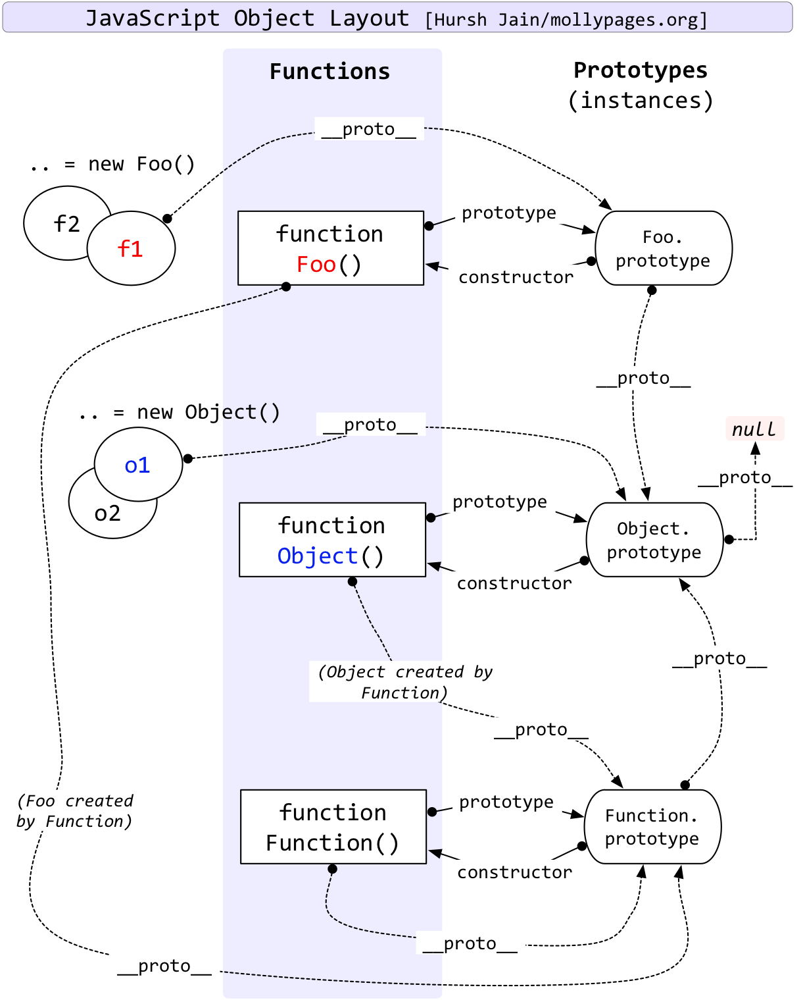

## 对象、类与面向对象编程
### 理解对象
ECMA-262 将对象定义为一组属性的无序集合。严格来说，这意味着对象就是一组没有特定顺序的
值。对象的每个属性或方法都由一个名称来标识，这个名称映射到一个值。正因为如此（以及其他还未
讨论的原因），可以把 ECMAScript 的对象想象成一张散列表，其中的内容就是一组名/值对，值可以是
数据或者函数。
#### 对象解构
对象解构就是使用与对象匹配的结构来实现对象属性赋值。
```js
p={name:'dsys',age:10}
let {name,age,sex='man'}=p //name:dsys,age:10,sex:man
let {name:name1}=p//name1:dsys
```
### 创造对象
#### 工厂模式
工厂模式没有解决新创建的对象是什么类型
```js
function createUser(name,age){
 let o=new Object();
 o.name=name;
 o.age=age;
 o.sayName=function(){
     return this.name
 }
 return o;
}
let u1=createUser('dsys',12);
u1.sayName();
```
#### 构造函数模式
构造函数的问题在于其定义的方法会在每一个实例上面都创建一遍。
- 没有显示的创造对象
- 属性跟方法都复制给了this
- 没有return

要创建User的实例，应使用**new** 操作符。以这种方式调用构造函数会执行如下操作。

(1) 在内存中创建一个新对象。
(2) 这个新对象内部的[[Prototype]]特性被赋值为构造函数的 prototype 属性。
(3) 构造函数内部的 this 被赋值为这个新对象（即 this 指向新对象）。
(4) 执行构造函数内部的代码（给新对象添加属性）。
(5) 如果构造函数返回非空对象，则返回该对象；否则，返回刚创建的新对象
```js
function User(name,age){
    this.name=name;
    this.age=age;
    this.sayName=function(){
        return this.name;
    }
}
let u1=new User('dsys',12);
u1.sayName();
```
#### 原型模式
在Js中函数是一种特殊的对象,函数其实是对象的一种。对象包括__proto__跟constructor属性，函数额外包括prototype属性。
##### prototype属性
prototype属性是函数指向其原型对象，函数可以找到其原型。
##### __proto__属性
__proto__属性指向其构造函数的原型对象，从而可以或者父类在原型上的属性跟方法
##### contructor
contructor指向其构造函数,指到该对象是谁的实例。实例是通过__proto__指向其原型对象，原型对象的contructor指向其构造函数。（继承过来的）
