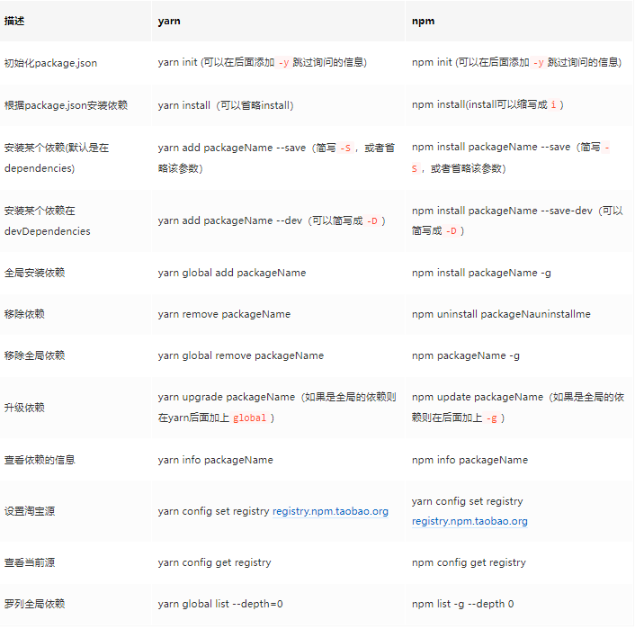

# NPM笔记
> npm的全称是(Node Package Manager)，是随同NodeJS一起安装的包管理和分发工具，它很方便让JavaScript开发者下载、安装、上传以及管理已经安装的包。
## Npm常用命令
```shell
npm install -g <package name> #全局安装模块
npm install <packageName>@<version> #安装指定版本
npm install <packageName> -f #，一个模块不管是否安装过，npm 都要强制重新安装
npm install <packageName> -S #等同于--save模块名将被添加到dependencies
npm install <packageName> -D #等同于--save-dev模块名将被添加到devDependencies
npm run <script命令> #执行package.json中script中对应命令
npm uninstall <packageName> #卸载模块
````
## Npm Link
开发NPM模块的时候，有时我们会希望，边开发边试用，比如本地调试的时候，require('myModule')会自动加载本机开发中的模块。Node规定，使用一个模块时，需要将其安装到全局的或项目的node_modules目录之中。对于开发中的模块，解决方法就是在全局的node_modules目录之中，生成一个符号链接，指向模块的本地目录。

npm link就能起到这个作用，会自动建立这个符号链接。

请设想这样一个场景，你开发了一个模块myModule，目录为src/myModule，你自己的项目myProject要用到这个模块，项目目录为src/myProject。首先，在模块目录（src/myModule）下运行npm link命令。
```
src/myModule$ npm link
```
上面的命令会在NPM的全局模块目录内，生成一个符号链接文件，该文件的名字就是package.json文件中指定的模块名。
/path/to/global/node_modules/myModule -> src/myModule
这个时候，已经可以全局调用myModule模块了。但是，如果我们要让这个模块安装在项目内，还要进行下面的步骤。

切换到项目目录，再次运行npm link命令，并指定模块名。
```
src/myProject$ npm link myModule
```
上面命令等同于生成了本地模块的符号链接。

src/myProject/node_modules/myModule -> /path/to/global/node_modules/myModule
然后，就可以在你的项目中，加载该模块了。
```
var myModule = require('myModule');
```
这样一来，myModule的任何变化，都可以直接反映在myProject项目之中。但是，这样也出现了风险，任何在myProject目录中对myModule的修改，都会反映到模块的源码中。

如果你的项目不再需要该模块，可以在项目目录内使用npm unlink命令，删除符号链接。
```
src/myProject$ npm unlink myModule
```
## npm与yarn对比
